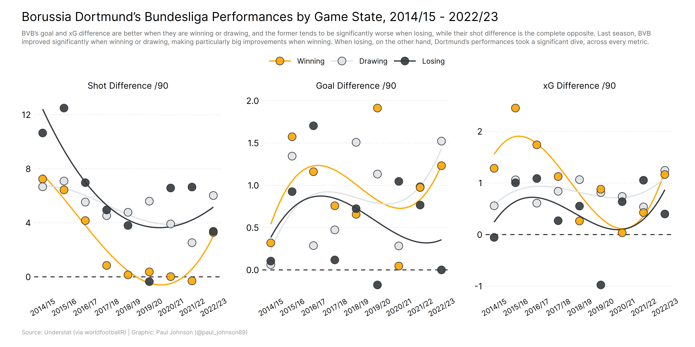
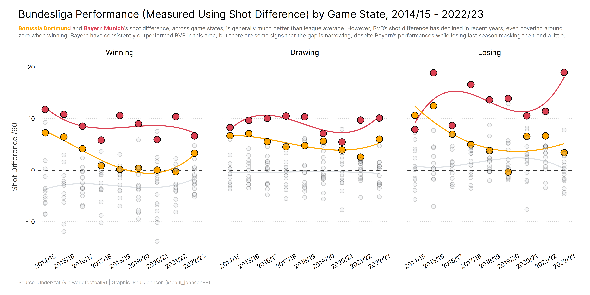
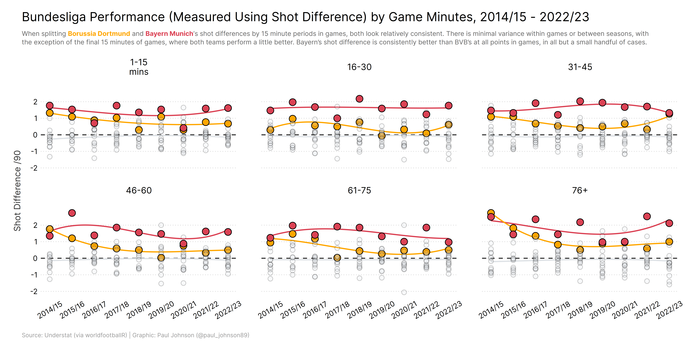
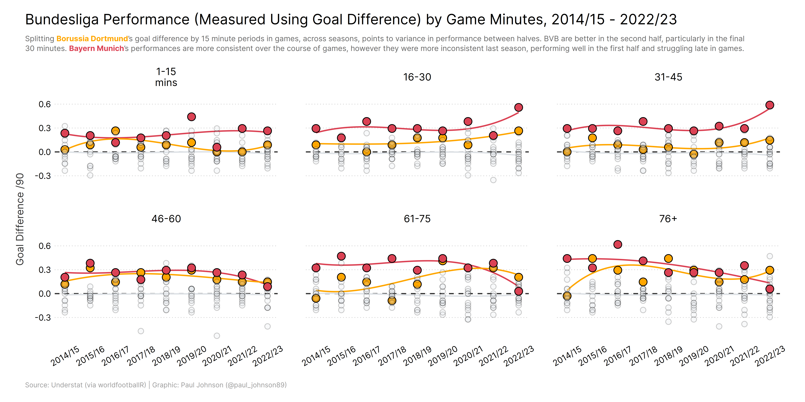
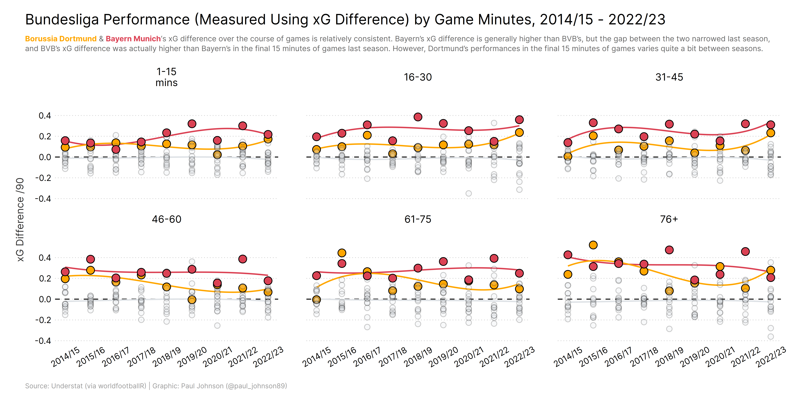

# BVB's Performances Across Match Contexts

I spent some time analysing Borussia Dortmund's performances across various match contexts from 2014/15 to 2022/23, with a bit of an eye towards the supposed "mentally problems" that the team are often accused of having. I looked at BVB's performances across game state, points from winning and losing positions, and performance by game minutes. The code for the analysis can all be found in the `functions.R` script in the /R subdirectory.

The plots produced are below (and can be found in the /figures subdirectory).

## Game State

## Points Dropped from Winning Positions

## Points Gained from Losing Positions

## Performance by Game Minutes

